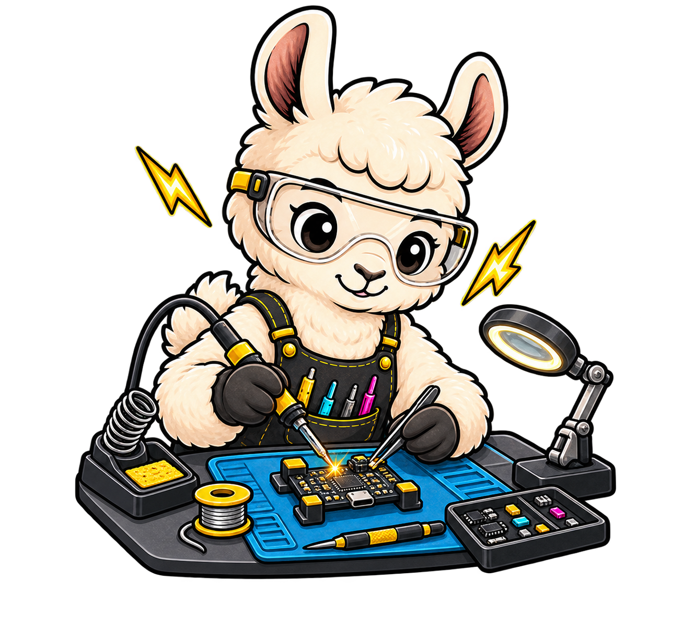

# Enclosures

{ .mascot-float-right }

The repository contains printable mesh outputs for a two-piece Rev A enclosure.
These are ready to inspect and slice, but the editable mechanical CAD source is not
currently included.

## Choose a variant

| File | Use when… |
| --- | --- |
| `pt1_case_bottom_RevA.stl` | you want the standard bottom shell |
| `pt1_case_bottom_oobb_RevA.stl` | you want the OOBB-compatible mounting variant |
| `pt1_case_top_withHeader_RevA.stl` | the six-pin header must remain accessible |
| `pt1_case_top_noHeader_RevA.stl` | the header is absent or should remain covered |

All files live under `case/Rev A/`.

## Slicer checklist

Because printer, material, and slicer behavior vary, treat the following as a
validation sequence rather than universal settings:

1. Import the top and selected bottom separately and inspect mesh units.
2. Confirm USB-C, USB-A, header, LED, and mounting-hole clearances in preview.
3. Choose orientation to keep connector openings dimensionally stable.
4. Review bridges and supports around openings; avoid support scars on mating faces.
5. Print a draft before using expensive material.
6. Deburr carefully and test-fit the unpowered PCB without forcing connectors.

## Fit check

- The PCB should sit flat without bowing.
- No printed feature should touch solder joints or component bodies unexpectedly.
- USB plugs should insert fully without using the enclosure as a lever.
- The PWR LED should remain visible.
- The selected top must match the actual header population.
- Fasteners must not crush the PCB or short exposed copper.

!!! caution "Mesh-only limitation"
    STL files are tessellated outputs. If dimensional changes are required, request
    or contribute editable mechanical source rather than repeatedly deforming the
    mesh. Any revised enclosure should use a new revision directory.

## Contributing a print report

Include printer model, process, material, nozzle or optical resolution, layer
height, orientation, support strategy, shrink/scale adjustment, and photographs of
connector and header fit. Note the exact PCB and case revisions.

