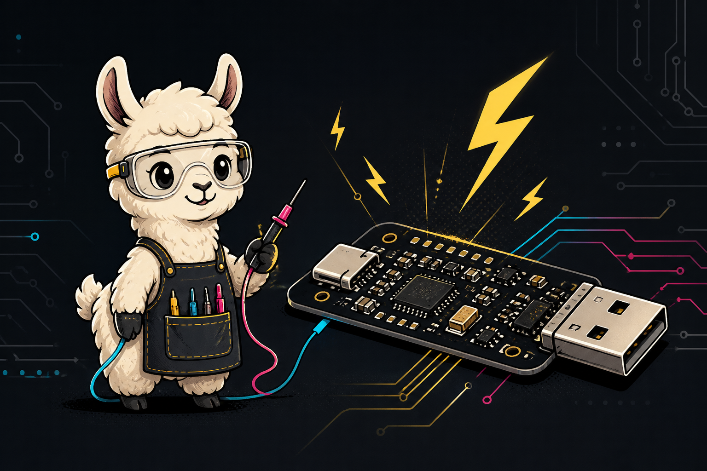

---
hide:
  - navigation
---

# pt1: one cable, four useful tricks

{ .hero-image }

pt1 is a compact open-hardware tool for the awkward middle of hardware
development: the point where a new target needs USB connectivity, a serial
console, repeatable power cycling, and enough protection to make experiments less
fragile.

## USB hub

One upstream USB-C connection becomes two downstream sockets, a header-accessible
USB port, and the internal serial bridge.

## UART

The CH343P bridge gives the target a practical serial console while retaining its
modem-control signals for hardware automation.

## Switched power

DTR controls a protected 5 V rail, making manual and scripted power cycles possible
without adding a target-side protocol.

## Fault reporting

The load switch's active-low fault output reaches RI, so software can detect
over-current or over-temperature conditions.

## Choose your route

- **First connection:** follow [Getting started](getting-started.md).
- **Wiring:** use [Pinout and connections](pinout.md).
- **Automation:** read [Power control](power-control.md) and run the Python example.
- **Circuit design:** explore the [Hardware overview](hardware.md) and
  [Design reference](reference.md).
- **Reproduction:** use [Build and manufacture](manufacturing.md), noting that the
  repository currently contains editable sources rather than a release fabrication
  pack.

  

    
  

  

    <h3>The key mental model</h3>
    
pt1 does not speak a custom power-control protocol. It reuses two standard serial modem signals:

    <table>
      <thead>
        <tr><th>Serial signal</th><th>pt1 meaning</th><th>Common API state</th></tr>
      </thead>
      <tbody>
        <tr><td>DTR</td><td>switched target power</td><td><code>False</code> = on, <code>True</code> = off</td></tr>
        <tr><td>RI</td><td>load-switch fault</td><td>asserted = fault present</td></tr>
      </tbody>
    </table>
    
Because serial drivers and terminal programs may change DTR when opening a port, control software should always set it explicitly and leave power off on exit.

  

!!! warning "USB power is not a laboratory supply"
    The load switch adds useful protection, but available current still depends on
    the host, upstream supply, cable, and complete USB power path. pt1 does not
    measure voltage or current and is not a calibrated power meter.

## Current source revisions

| Item | Revision | Location |
| --- | --- | --- |
| PCB assembly | A2 | `pcba/Rev A2/` |
| Printable enclosure | A | `case/Rev A/` |
| Pinout source | current working source | `pinout/` |

The editable files above are the source of truth. See the
[repository guide](repository-guide.md) for revision and generated-file policy.
