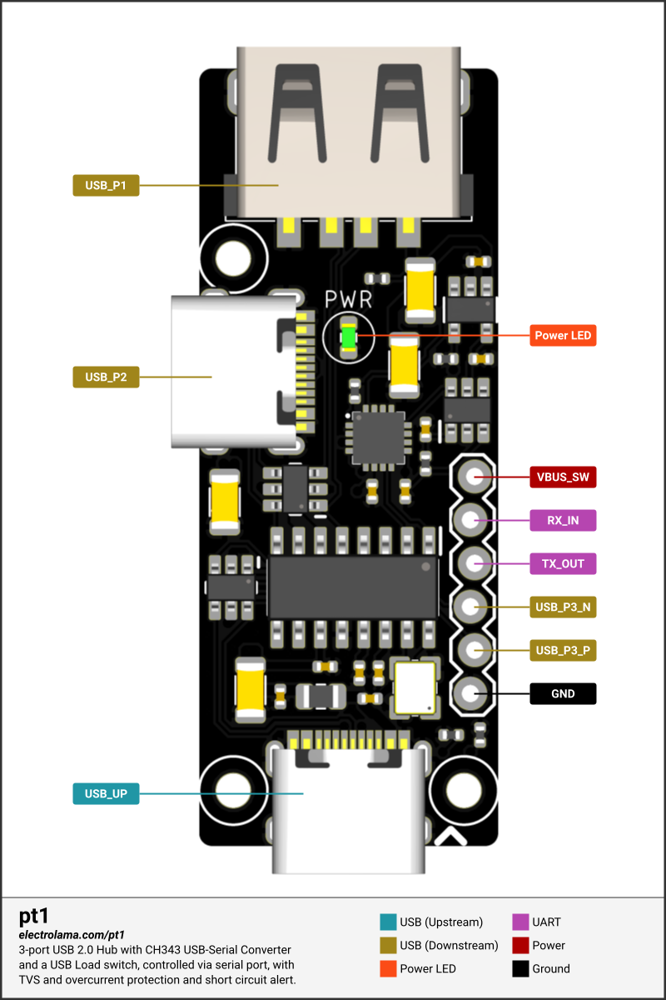

# Pinout and connections

The original generated pinout is copied here for the documentation build. Its
authoritative source remains `pinout/diagram.svg`, generated from
`pinout/pinout_diagram.py`, `pinout/data.py`, and `pinout/styles.css`.

<div class="llama-frame" markdown>



</div>

## Six-pin header

Pin numbering follows the published pt1 connection table. Confirm orientation from
the diagram and PCB markings before attaching a keyed or custom cable.

| Pin | Source label | Function | Connect to |
| ---: | --- | --- | --- |
| 1 | `VBUS_SW` | protected, switched USB 5 V output | compatible target 5 V/USB power input |
| 2 | `RX_IN` | pt1 UART receive | target TX |
| 3 | `TX_OUT` | pt1 UART transmit | target RX |
| 4 | `USB_P3_N` | header USB port D− | target USB D− |
| 5 | `USB_P3_P` | header USB port D+ | target USB D+ |
| 6 | `GND` | common reference | target ground |

!!! note "Names in prose and names in source"
    Published material may shorten these labels to `VUSB_SW`, `RXI`, `TXO`,
    `USB_N`, and `USB_P`. This documentation uses the names in the repository's
    pinout data whenever possible.

## USB topology

```text
Host USB-C
    │
    └── USB 2.0 hub
        ├── downstream USB-C
        ├── downstream USB-A (switched power)
        ├── header USB data + switched power
        └── internal CH343P USB-to-UART bridge
```

All external connectors carry USB 2.0 data only. The USB-C connectors do not expose
SuperSpeed lanes.

## Power domains

`VUSB`
: The unswitched USB supply inside pt1.

`VBUS_SW` / `VUSB_SW_OUT`
: The output of the protected load-switch path. Repository artifacts use both names
  in different presentation layers; consult the schematic nets when modifying the
  design.

Downstream USB-C selection
: A solder jumper selects whether the downstream USB-C connector receives switched
  or unswitched USB power. Do not short both selections.

## UART and control signals

The header exposes TX and RX, but power control uses unexposed CH343P modem signals:

| Signal | Direction relative to pt1 | Internal job |
| --- | --- | --- |
| DTR | host software → pt1 | controls load-switch enable through logic conditioning |
| RI | pt1 → host software | reports the active-low load-switch fault output |

See [Power control](power-control.md) for polarity and safe software behavior.

## Wiring quality

- Cross UART TX and RX; connect ground first.
- Keep the header USB D+/D− pair short, adjacent, and similar in length.
- Avoid loose breadboard wiring for marginal USB links.
- Do not assume cable colours identify D+/D− reliably.
- Check for target back-powering through UART, USB data protection, debug probes, or
  other interfaces when validating the off state.

